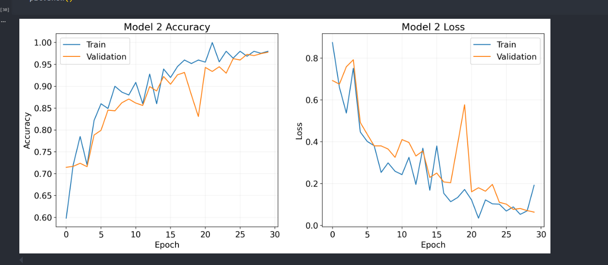
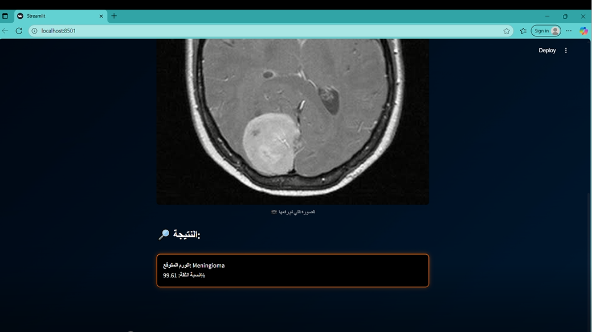
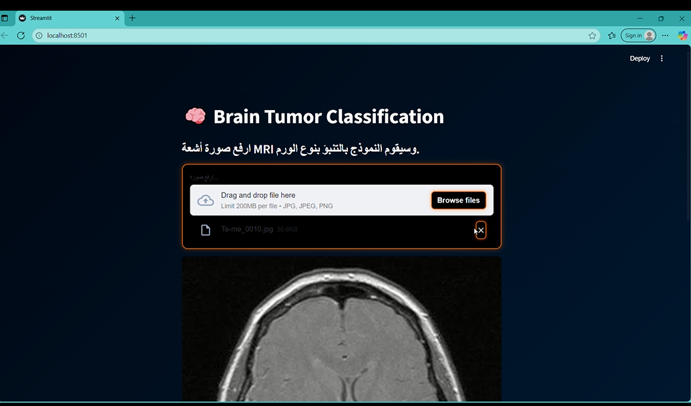

# Brain Tumor Classification using CNN (MRI Images)

## Project Description

This project implements a Convolutional Neural Network (CNN) to classify brain MRI images into four categories:

- Glioma
- Meningioma
- Pituitary Tumor
- No Tumor

The model was developed using TensorFlow/Keras and trained on MRI images after applying preprocessing steps including image resizing (150×150), normalization, and data augmentation using ImageDataGenerator.

The CNN architecture includes multiple Conv2D and MaxPooling layers followed by Fully Connected layers with Dropout for regularization and a Softmax output layer for multi-class classification.

The objective of this project is to automatically detect and classify brain tumors from MRI scans using deep learning techniques.

---

## Dataset Description

Dataset used in this project:

Brain Tumor MRI Dataset

Source:

https://github.com/sartajbhuvaji/brain-tumor-classification-dataset

The dataset contains MRI brain images divided into four classes:

- Glioma
- Meningioma
- Pituitary
- No Tumor

Images are organized into Training and Testing folders and were used directly for model training and evaluation.

---

## Project Pipeline

Steps implemented in this project:

1. Load MRI images from dataset folders
2. Resize images to 150×150 pixels
3. Normalize image values
4. Apply data augmentation using ImageDataGenerator
5. Build CNN architecture using Conv2D and MaxPooling layers
6. Add Dense layer (512 neurons) with Dropout (0.5)
7. Train model using Adam optimizer
8. Evaluate model performance using accuracy metric
9. Visualize training accuracy and loss curves
10. Generate prediction results on MRI test samples

---

## Model Training Accuracy

Training and validation accuracy curves:

---

## Sample Prediction Results

Example predictions from the trained CNN model:

---

## Saved Model

The trained model is saved as:

brain_tumor_model.keras

This allows reproducibility and reuse without retraining.

---

## Project Structure

Brain-Tumor-Classification-CNN-MRI

├── CNNBrainTumorClassification.ipynb  
├── requirements.txt  
├── README.md  
├── brain_tumor_model.keras  
